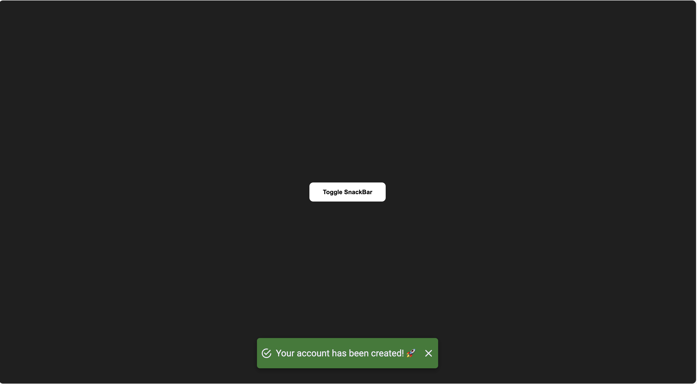

# 1조 추가 과제 공간 - Notification
`자신의 학번 폴더` 안에 파일들을 담아서 PR 올려주시면 돼요! 
EX) 5648478 폴더 내에, `index.html`, `style.css`, `script.js` 파일을 생성
### PR은 다음과 같이 작성합니다
* `자신의 학번을 최상위 폴더의 이름으로` 사용
    * 내부에 필요한 파일들을 작성해주시면 됩니다
* PR시에는, `댓글`에 다음과 같이 남겨주셔야합니다
    * 구현 화면(`동영상`이면 더 좋아요)
* PR의 title은 자신의 이름으로 작성해주세요
> **선택사항**(해주시면 더 좋구요) 
제가 코드 읽는 시간을 좀 줄여주시려면, `코드에 설명`을 적어주시면 더 좋을 거 같습니다.

### 추가적으로, 다음 내용을 구현해주세요
아래 사진을 보시면, 중앙 흰 네모를 클릭하면, 아래에 초록색 notification(알람)이 뜹니다. 검은 배경을 누르면 다시 알람이 사라지는데요. 
**여러분들은 추가적으로 초록색 알림 오른쪽의 X 버튼을 클릭시 알람이 사라질 수 있도록 js코드를 수정해주시면 됩니다.**
