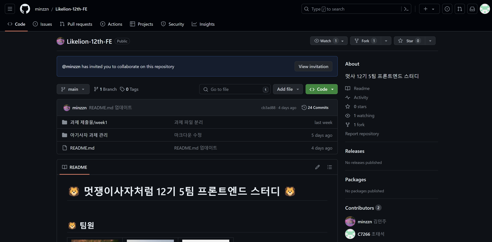

# <center>멋쟁이사자처럼 12기 프론트엔드 2주차 과제</center>
<br>


<div style="border : 1px solid #ccc; padding: 10px;">

# 목차
[1.](#1-서론) 서론
<br>
&nbsp;&nbsp; [1.1.](#1-git-소개) Git 소개
<br>
&nbsp;&nbsp; [1.2.](#2-버전-관리-시스템의-중요성) 버전 관리 시스템
<br>
[2.](#2-본론) 본론
<br>
&nbsp;&nbsp; [2.1.](#1-merge) Fork
<br>
&nbsp;&nbsp; [2.2.](#2-branch) Branch
<br>
&nbsp;&nbsp; [2.3.](#3-merge) Merge
<br>
&nbsp;&nbsp; [2.4.](#4-pull-request) Pull Request
<br>
[3.](#3-참고문헌) 참고문헌
<br>

</div>

## 1. 서론

#### 1. Git 소개

깃(Git)은 리누스 토르발스에 의해 개발된 '분산 버전관리 시스템(Distributed Version Control System - DVCS)'으로, 컴퓨터 파일의 변경사항을 추적하고 여러명의 사용자들 간에 파일에 대한 작업을 조율하는데 사용된다.

즉, 주로 여러명의 개발자가 하나의 소프트웨어 개발 프로젝트에 참여할 때, 소스코드를 관리하는데 주로 사용된다. 그렇다면 버전관리는 왜 필요한가?

#### 2. 버전 관리 시스템의 중요성

버전 관리 시스템은 팀 단위로 개발 중인 소스 코드나, 청사진 같은 설계도 등의 디지털 문서들의 변경 사항들에 숫자나 문자로 이뤄진 "버전"을 부여해서 구분, 관리하는 것을 말한다.

버전 관리 시스템은 아래와 같은 이유로 중요하게 사용된다.

- 무언가 잘못되었을 때 복구를 돕기 위하여

- 프로젝트 진행 중 과거의 어떤 시점으로 돌아갈 수 있게 하기 위하여

- 여러사람이 같은 프로젝트에 참여할 경우, 각자가 수정한 부분을 팀원 전체가 동기화하는 과정을 자동화하기 위하여

- 소스 코드의 변경 사항을 추적하기 위하여

- 소스 코드에서 누가 수정했는지 추적하기 위하여

- 대규모 수정 작업을 더욱 안전하게 진행하기 위하여

- 가지내기(Branch)로 프로젝트에 영향을 최소화 하면서 새로운 부분을 개발하기 위하여

- 접붙이기(Merge)로 검증이 끝난 후 새로이 개발된 부분을 본류(trunk)에 합치기 위하여

- 많은 오픈 소스 프로젝트에서 어떠한 형태로든 버전 관리를 사용하고 있으므로 코드의 특정 부분이 왜 그렇게 쓰여 졌는지 의미를 추적하기 위하여

## 2. 본론

앞서 버전 관리 시스템의 중요성을 알아봤으니, 이제는 

### 1. Fork
&nbsp;1-1. Fork란?
<br>
&nbsp;&nbsp; Fork란 다른 사람의 Github repository를 복제하여 특정 부분을 수정, 추가, 삭제를 용이하게 해주는 복제기능이다. Fork한 저장소는 원본(Repository)와 연결되어 있어 후술할 Pull request 기능으로 원작자에게 보내는것이 가능하다.
<br><br>
&nbsp;1-2. Fork의 사용법

</img>
Fork하고싶은 repository에 들어가 우측 상단의 Fork를 눌러주면 된다.


### 2. Branch
&nbsp;2-1. Branch란?
<br>
&nbsp;&nbsp; Branch란 코드를 짜다가 새로운 기능을 추가하려고 할 때, 코드를 잘못짜서 버그가 일어나 프로그램이 망가질 위험이 있으므로 파일의 복사본을 만들어서 그곳에서 먼저 실행해볼 수 있게 해주는 기능이다.
<br><br>
&nbsp;2-2. Branch의 사용법
<br>
```
$ git branch (브랜치 이름)       // 프로젝트 사본 생성
$ git switch (브랜치 이름)       // 해당 브랜치로 이동

위 과정 후 작업을 진행하면 되지만 추가로 다른 명령어들도 존재한다.

$ git status                  // 내가 현재 사용중인 branch를 확인할 수 있다.
$ git switch (main or master)   // 다시 원래 branch로 돌아온다.
$ git branch -a               // 현재 존재하는 모든 branch를 보여준다.
$ git branch -d (브런치 이름)    // 브런치를 삭제한다.
```

### 3. Merge
&nbsp;3-1. Merge란?
<br>
&nbsp;&nbsp; Merge는 앞에서 Branch로 만든 프로젝트의 사본을 원래 파일에 합치는 작업을 말한다.
<br><br>
&nbsp;3-2. Merge의 사용법
```
$ git checkout (main or master) // 다시 원래의 branch로 돌아온다.
$ git log
$ git merge (작업을 진행한 branch) // main or master branch와 합친다.
$ git log

$ git push origin (main or master) // merge가 완료되었으면 push까지 진행해 원격 저장소에 반영해준다.
```
### 4. Pull Request
&nbsp;4-1. Pull Request란?
<br>
&nbsp;&nbsp; 상대방의 저장소를 Fork하여 작업을 끝낸 후 원본 저장소에 올리고 싶을 때 사용하는 기능이다. 원본 저장소의 권한을 가진 사람에게 두 브랜치를 합치는 것을 허락해 달라고 요청을 보내 상대방이 허락한다면 변경점이 반영된다.
<br><br>
&nbsp;4-2. Pull Request의 사용법

1. Fork한 repository에 들어가 좌측 상단의 Pull requests를 들어간다.
2. 우측 초록색 버튼 New pull request를 누른다.
3. 제목과 내용을 작성하고 상대방에게 전송한다.
<br>

## 3. 참고문헌
1. [알아서 잘 딱 깔끔하고 센스있게 정리하는 GitHub 핵심 개념](https://paullabworkspace.notion.site/GitHub-435ec8074bcf4353afb947f601a030df)

2. [마크다운(Markdown) 사용법](https://gist.github.com/ihoneymon/652be052a0727ad59601)