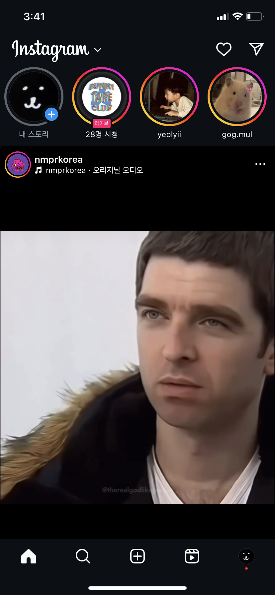
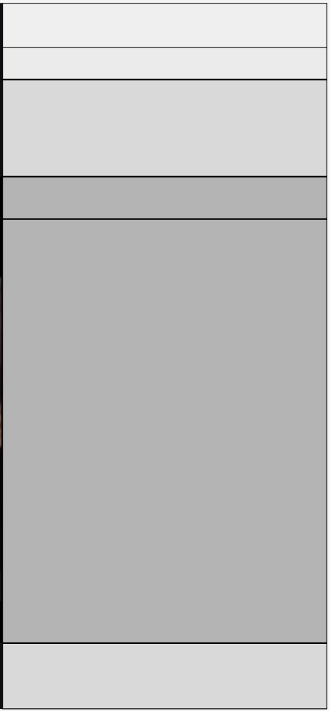

# 🦁 멋쟁이사자처럼 12기 프론트 추가 스터디 - 인스타그램 피드 클론코딩

 

## 💻 인스타그램 피드 클론코딩
이번 주는 인스타그램 앱 메인 화면 클론코딩입니다!!   
구글에 검색하면 예시가 여러개 나오지만, 다크모드이든 라이트 모드이든 인스타그램 앱 메인 화면과 똑같은 레이아웃으로 react.js 작업을 하셔서 코딩해주시면 되겠습니다. 제출 방법은  pull request이며, 제출하실 때 pull request에 결과 화면도 캡쳐해서 같이 올려주시면 감사하겠습니다

* 필독 - 요구사항   
✔️ styled-components, react.js 를 사용하여 작업할 것   
✔️ 폴더 구조를 나눌 것, 컴포넌트를 네 개로 나누어 작업할 것   
✔️ 인스타 스토리 테두리 색깔을 props로 지정할 것   
✔️ 내 계정 스토리의 색깔은 회색, 친구 계정 스토리 색깔 하나는 분홍색, 나머지 두 개는 연두색(친한 친구 스토리)으로 할 것   

* 질문이 있으면 언제든 카톡주세요 !!

 

🦁 **형식** - 각자 폴더명을 자기 이름으로 한 폴더를 team5 브랜치의 과제 제출물/additional study에 제출   
🦁 **내용** - react.js로 인스타그램 메인 화면 클론코딩 해보기, 다크/라이트 모드, 프로필 사진이나 피드 사진 등은 자유로 첨부      
🦁 **목적** - styled-components, props 복습하기   
🦁 **제출 방법** - git commit 후 team5 브랜치에 pull request로 !!   
🦁 **제출 기한** - 이번 주 금요일까지   

## 💫 인스타그램 메인 피드 화면 예시
   

## 💫 피드 레이아웃에 따른 컴포넌트 분리 예시 - 색깔 기준

