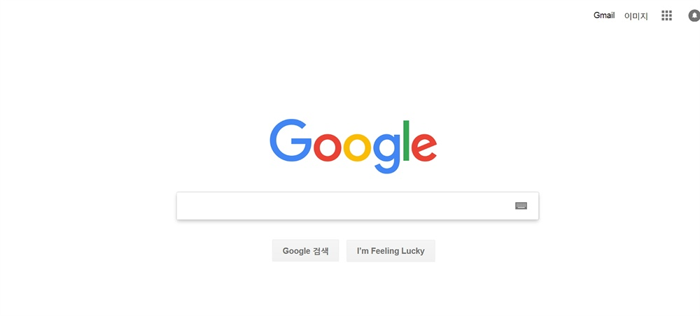

# 🦁 멋쟁이사자처럼 12기 프론트 5팀 - 3주차 과제

 

## 💻 구글 메인 페이지 클론코딩
이번 주는 구글 메인 화면 클론코딩입니다!!
구글에 검색하면 예시가 여러개 나오지만, 다크모드이든 라이트 모드이든 메인 화면과 똑같은 레이아웃으로 html/css 작업을 하셔서 코딩해주시면 되겠습니다. 제출 방법은 역시 pull request이며, 제출하실 때 pull request에 결과 화면도 캡쳐해서 같이 올려주시면 감사하겠습니다

 

🦁 **형식** - html/css 파일을 week3 폴더에 넣어서 제출   
🦁 **내용** - html과 css로 구글 페이지 클론코딩 해보기, 다크/라이트 모드 등 버전은 상관없음   
🦁 **목적** - 레이아웃과 css에 대해 배워보자 !!   
🦁 **제출 방법** - git commit 후 pull request로 !!    
🦁 **제출 기한** - 일주일 뒤인, 다음 주 수요일까지 (5/15)   

## 💫 구글 메인 화면 예시
